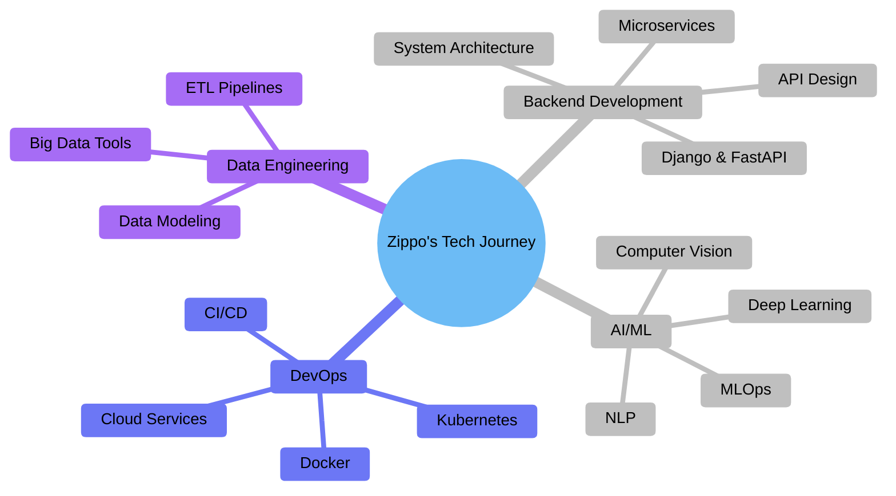

<div align="center">

#  Welcome to Zippo's Digital Universe 🌌


[](https://zipstudio.online/)
[](https://www.kaggle.com/realzippo)


</div>

---


## 🎭 Who Am I?


```javascript
const zippo = {
    pronouns: "He" | "Him",
    age: 22,
    location: "Earth 🌍",
    code: ["Python", "JavaScript", "SQL", "Bash"],
    askMeAbout: ["AI/ML", "Backend", "Data Science", "System Design"],
    technologies: {
        backend: {
            python: ["Django", "FastAPI", "Flask"],
            js: ["Node.js", "Express"],
            databases: ["PostgreSQL", "MongoDB", "Redis"]
        },
        aiml: ["TensorFlow", "PyTorch", "Keras", "Scikit-Learn"],
        devOps: ["Docker", "AWS", "CI/CD", "Nginx"],
        tools: ["Git", "Linux", "VS Code", "Jupyter"]
    },
    currentProject: "ZipStudio.online",
    funFact: "Bugs fear me, but segmentation faults still haunt me",
    challenge: "Building AGI... one model at a time 🤖"
};
```

<details>
<summary>📊 <b>More About My Coding Journey</b></summary>

<br>

```python
class ZippoCodingJourney:
    def __init__(self):
        self.started_coding = 2019
        self.lines_of_code_written = "1M+"
        self.coffee_consumed = "∞ cups ☕"
        self.bugs_created = "Too many to count 🐛"
        self.bugs_fixed = "bugs_created + 1"
        
    def daily_routine(self):
        activities = [
            "☕ Morning coffee",
            "💻 Code awesome features",
            "🔥 Debug mysterious errors",
            "📚 Learn something new",
            "🧘 Contemplate life choices",
            "🌙 Late night coding session"
        ]
        return activities
    
    def life_philosophy(self):
        return """
        while(alive) {
            eat();
            sleep();
            code();
            repeat();
            // Profit??? 🤔
        }
        """
```

</details>

---


## 🚀 Tech Arsenal & Superpowers

<div align="center">

### 💻 Language
[](https://www.python.org/)
[](https://www.postgresql.org/)


### 🎯 Backend Frameworks
[](https://www.djangoproject.com/)
[](https://fastapi.tiangolo.com/)

### 🗄️ Databases
[](https://www.postgresql.org/)
[](https://www.sqlite.org/)

### 🤖 AI/ML & Data Science
[](https://www.tensorflow.org/)
[](https://pytorch.org/)
[](https://keras.io/)
[](https://scikit-learn.org/)
[](https://pandas.pydata.org/)
[](https://numpy.org/)
[](https://matplotlib.org/)
[](https://opencv.org/)

### ☁️ Cloud & DevOps
[](https://aws.amazon.com/)
[](https://cloud.google.com/)
[](https://www.docker.com/)
[](https://kubernetes.io/)
[](https://www.nginx.com/)
[](https://github.com/features/actions)

### 🛠️ Tools & Others
[](https://git-scm.com/)
[](https://www.linux.org/)
[](https://code.visualstudio.com/)
[](https://jupyter.org/)
[](https://www.postman.com/)
[](https://restfulapi.net/)
[](https://graphql.org/)

</div>

---


## 📊 GitHub Analytics & Stats

<div align="center">
  


</div>


<details>
<summary><b>📈 More Stats & Metrics</b></summary>

<br>

<div align="center">


</div>

</details>

---


## 🎯 Current Mission & Learning Path



<div align="center">

### 🎓 Currently Learning
```python
learning_path = {
    "🧠 Deep Learning": ["Neural Networks", "CNNs", "RNNs", "Transformers"],
    "☁️ Cloud Native": ["Kubernetes", "Serverless", "Cloud Architecture"],
    "📊 MLOps": ["Model Deployment", "Monitoring", "AutoML"],
    "🔐 Security": ["API Security", "Authentication", "Best Practices"],
    "🚀 Performance": ["Caching", "Load Balancing", "Optimization"]
}

for topic, subtopics in learning_path.items():
    print(f"Mastering: {topic}")
    for subtopic in subtopics:
        print(f"  ✓ {subtopic}")
```

</div>

---


## 🌟 Featured Projects

<div align="center">

<table>
<tr>
<td width="50%">

### 🚀 ZipStudio
**AI-Powered Development Platform**
- Built with Django & TensorFlow
- Real-time collaboration features
- ML model deployment pipeline
- 1000+ active users

[](https://zipstudio.online/)

</td>
<td width="50%">

### 🤖 ML Model Zoo
**Collection of Pre-trained Models**
- Image Classification
- NLP Tasks
- Time Series Forecasting
- Easy deployment API

[](https://github.com/ZippoAI)

</td>
</tr>
<tr>
<td width="50%">

### 📊 DataViz Dashboard
**Interactive Data Analytics Tool**
- Real-time data processing
- Beautiful visualizations
- Export & sharing features
- PostgreSQL + Redis backend

[](https://github.com/ZippoAI)

</td>
<td width="50%">

### ⚡ FastAPI Microservices
**Scalable Backend Architecture**
- Event-driven design
- Docker containerized
- API Gateway pattern
- 99.9% uptime

[](https://github.com/ZippoAI)

</td>
</tr>
</table>

</div>

---


## 💭 Developer Wisdom

<div align="center">


### 🎯 My Coding Principles
  
> **"Code is like humor. When you have to explain it, it's bad."** – Cory House

> **"First, solve the problem. Then, write the code."** – John Johnson

> **"The best error message is the one that never shows up."** – Thomas Fuchs

</div>

---


## 🎵 Spotify Playing

<div align="center">

[](https://open.spotify.com/user/username)

**Currently vibing to some lo-fi beats while crushing bugs** 🎧

</div>

---


## 🤝 Let's Connect & Collaborate!

<div align="center">

### 📱 Find Me Across The Internet

<a href="https://github.com/ZippoAI">
  
</a>
<a href="https://www.linkedin.com/in/zipppo/">
  
</a>
<a href="https://www.kaggle.com/realzippo">
  
</a>
<a href="https://www.instagram.com/zippo.sensei/">
  
</a>
<a href="https://devfolio.co/@bulbul77">
  
</a>

### 💬 Ask Me About
`Python` `Django` `FastAPI` `Machine Learning` `TensorFlow` `PostgreSQL` `Docker` `AWS` `System Design` `API Development`

### 📫 How to Reach Me
- 💼 **LinkedIn:** Let's connect professionally!
- 📸 **Instagram:** Behind the scenes of my dev life

</div>

---


## ☕ Support My Journey


---

<div align="center">

### 📈 Profile Views & Visitors


### ⭐ If you find my projects interesting, don't forget to star them!


---

```ascii
╔═══════════════════════════════════════════════════════════╗
║  "Talk is cheap. Show me the code." - Linus Torvalds     ║
╚═══════════════════════════════════════════════════════════╝
```

**Made with 💙 and lots of ☕ by Zippo**

*Last Updated: December 2025*

</div>
